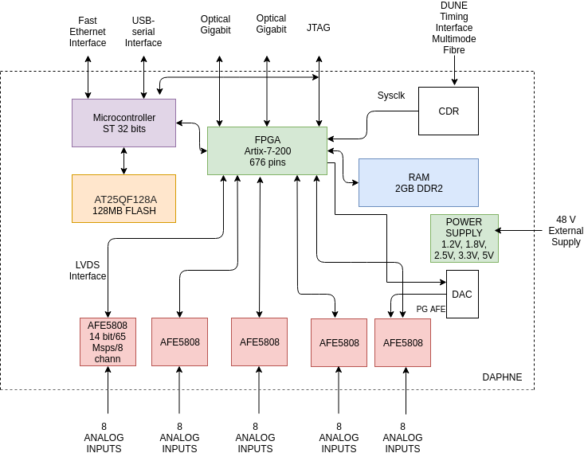

# DAPHnE Firmware
firmware for the DAPHnE Board that digitizes signals from ARAPUCAS in the far detector at DUNE experiment in FERMILAB

> **Note:** Tested on Debian 10

## Intro:
In this repository, we experiment running dedicated digital modules with a bare-bones [VexRiscv](https://github.com/SpinalHDL/VexRiscv) CPU, a 32-bits Linux Capable RISC-V CPU written in Spinal HDL. The Firmware is created around the VexRiscv CPU using LiteX as the SoC builder and special cores written in Migen Python DSL (LiteADS, LiteDRAM, LiteEth).

This project demonstrates **how high level HDLs (Spinal HDL, Migen) enable new possibilities and complement each other**. Results shown here are the results of a productive collaboration between open-source communities.

## Main Scheme
[

## Dependencies
```sh
$ sudo apt install build-essential device-tree-compiler
```
[migen](https://github.com/m-labs/migen)
```sh
$ sudo pip3 install migen
```
[litex](https://github.com/litex-hub/litex-getting-started)
```sh
$ wget https://raw.githubusercontent.com/enjoy-digital/litex/master/litex_setup.py
$ chmod +x litex_setup.py
$ sudo ./litex_setup.py init install
```
[RiscV]()
```sh
$ wget https://static.dev.sifive.com/dev-tools/riscv64-unknown-elf-gcc-8.1.0-2019.01.0-x86_64-linux-ubuntu14.tar.gz
$ tar -xvf riscv64-unknown-elf-gcc-8.1.0-2019.01.0-x86_64-linux-ubuntu14.tar.gz
$ export PATH=$PATH:$PWD/riscv64-unknown-elf-gcc-8.1.0-2019.01.0-x86_64-linux-ubuntu14/bin/
```

### Load the FPGA bitstream
To load the bitstream to you board, run:
```sh
$ ./make.py --board=daphne --load
```

### Load the Linux images over Serial
The board support Serial loading of the Linux images and this is the only way to load them when the board does not have others communications interfaces or storage capability.

To load the Linux images over Serial, use the [lxterm](https://github.com/enjoy-digital/litex/blob/master/litex/tools/litex_term.py) terminal/tool provided by LiteX and run:
```sh
$ ls /dev/ttyUSB*
$ lxterm --images=images.json /dev/ttyUSBX --speed=2e6 --no-crc
```
The images should load and you should see Linux booting :)

> **Note**: lxterm is automatically installed with LiteX.

> **Note:** since on some boards JTAG/Serial is shared, when you will run lxterm after loading the board, the BIOS serialboot will already have timed out. You will need to press Enter, see if you have the BIOS prompt and type *reboot*.

Since loading over Serial is working for all boards, **this is the recommended way to do initial tests** even if your board has more capabilities.

### Load the Linux images over TFTP
The board can be programmed via Ethernet,  the Linux images can be loaded over TFTP. You need to copy the files in *buildroot* directory and *emulator/emulator.bin* to your TFTP root directory. The default Local IP/Remote IP are 192.168.1.50/192.168.1.100 but you can change it with the *--local-ip* and *--remote-ip* arguments.

Once the bistream is loaded, the board you try to retrieve the files on the TFTP server. If not successful or if the boot already timed out when you see the BIOS prompt, you can retry with the *netboot* command.

The images should load and you should see Linux booting :)

### Load the Linux images to SPI-Flash
For boards that have SPI Flash (and enough space on it to store the images), the Linux images can be written to
SPI Flash and directly loaded during boot.

To flash the bitstream and linux images to you board, run:
```sh
$ ./make.py --board=XXYY --flash
```

When done, the FPGA of the board should automatically reload itself from the SPI-Flash, start the BIOS, copy
the Linux images to RAM and boot :)

## Generating the Linux binaries (optional)
```sh
$ git clone http://github.com/buildroot/buildroot
$ cd buildroot
$ make BR2_EXTERNAL=../linux-on-litex-vexriscv/buildroot/ litex_vexriscv_defconfig
$ make
```
The binaries are located in *output/images/*.

